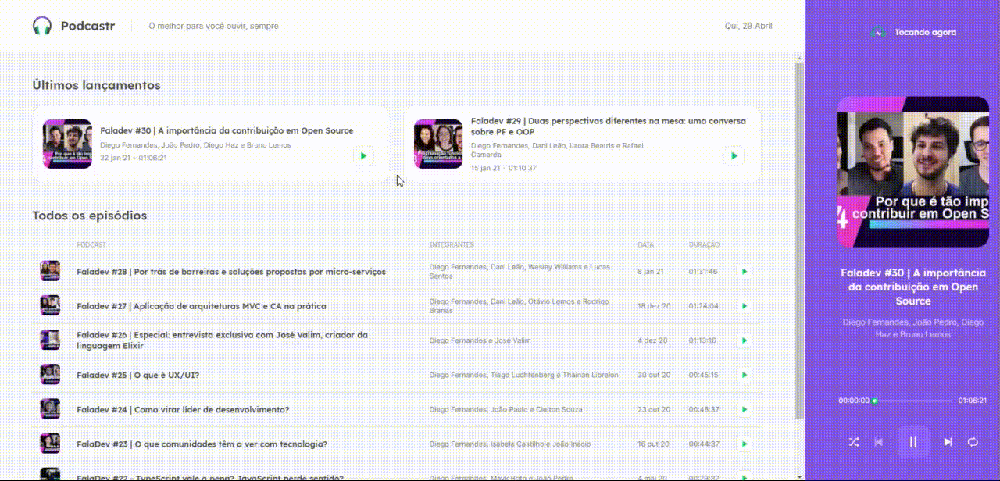

# 

<center ></center>

  ## 📒 Sobre o Podcastr
  O Podcastr foi um projeto desenvolvido durante o evento NLW5 da Rocketseat, é
  um web site com o foco em Podcast, onde o usuário poderá ouvir seus podcast 
  enquanto faz outras atividades!
  
  ## 🌟 Tecnologias Usadas
  Essa aplicação foi desenvolvida com as seguintes tecnologias:
  
  - [React](https://reactjs.org/)
  - [Next.js](https://nextjs.org/)

  ## 💾 Instalando os Programas Necessários
  Para instalar os programas use esse comando:
  ```
  yarn
  ```
  - Caso não tenha o yarn siga o passo a passo de como instalar no seguinte link: https://classic.yarnpkg.com/en/docs/install/#windows-stable)

  Para iniciar o projeto no navegador utilize este comando:
  ```
  yarn dev
  ```
  Para iniciar o projeto em uma build utilize esse comando:
  ```
  yarn server
  ```
